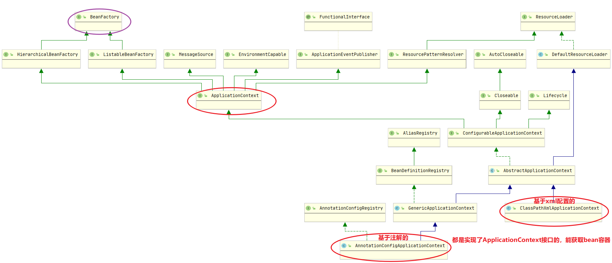

# Spring基础

## 控制反转Ioc



### 获取Spring容器Ioc的三种方式

 **1、通过实现ApplicationContextAware接口，获取applicationContext**
具体代码如下： 

```java
package org.xjt.spring.utils;

import org.springframework.beans.BeansException;
import org.springframework.context.ApplicationContext;
import org.springframework.context.ApplicationContextAware;
import org.xjt.spring.service.SomeService;

public class SpringContextUtil implements ApplicationContextAware {
    // Spring应用上下文环境
    private static ApplicationContext applicationContext;

    @Override
    public void setApplicationContext(ApplicationContext applicationContext) throws BeansException {
        System.out.println("获取ApplicationContext");
        SpringContextUtil.applicationContext = applicationContext;
    }

    public static ApplicationContext getApplicationContext() {
        return applicationContext;
    }

    @SuppressWarnings("unchecked")
    public static  <T> T getBean(String name) throws BeansException {
        if (applicationContext == null){
            return null;
        }
        return (T)applicationContext.getBean(name);
    }

    /**
     * 获取类型为requiredType的对象
     *
     * @param clazz 需要获取的bean的类型
     * @return 该类型的一个在ioc容器中的bean
     * @throws BeansException 抛出spring异常
     */
    public static <T> T getBean(Class<T> clazz) throws BeansException {
        return applicationContext.getBean(clazz);
    }

    public static boolean containsBean(String name) {
        return applicationContext.containsBean(name);
    }
}
```

在xml中配置bean

> 注：方法类SpringContextUtil是一个bean，之所以方法类SpringContextUtil能够灵活自如地获取
>
> ApplicationContext就是因为spring能够为我们自动地执行了SpringContextUtil。
>
> 但是spring不会无缘无故地为某个类执行它的方法的，所以就很有必要通过注册方法类SpringContextUtil的
>
> 方式告知spring有这样子一个类的存在；将方法类ApplicationContextUtil作为一个普通的bean在spring的配
>
> 置文件中进行注册，在springbean1.xml文件中配置如下：

```xml
<?xml version="1.0" encoding="UTF-8"?>
<beans xmlns="http://www.springframework.org/schema/beans"
       xmlns:xsi="http://www.w3.org/2001/XMLSchema-instance"
       xsi:schemaLocation="http://www.springframework.org/schema/beans http://www.springframework.org/schema/beans/spring-beans.xsd">

    <bean id="someService" class="org.xjt.spring.service.impl.SomeServiceImpl"></bean>

    <bean id="springContextUtil" class="org.xjt.spring.utils.SpringContextUtil"></bean>
</beans>
```

**ApplicationContextUtil**类的使用

通过getBean方法来获取spring容器中的某个Bean，例如

```java
ApplicationContext applicationContext = new ClassPathXmlApplicationContext("springbean1.xml");
SomeService bean1 = applicationContext.getBean("someService", SomeService.class);
System.out.println(bean1);

Object someService = SpringContextUtil.getBean("someService");
System.out.println(someService);
```

 **2、通过ClassPathXmlApplicationContext获取applicationContext**
这种方式只能获取指定的xml配置中的bean
具体代码如下：  

```java
ApplicationContext applicationContext = new ClassPathXmlApplicationContext("beans.xml");
System.out.println(applicationContext.getBean("user"));
System.out.println(applicationContext.getBean("AService"));
```

 User是resource文件夹下beans.xml文件中配置了的bean
AService是使用注解@Component注入的bean
结果是User可以返回bean而Aservice找不到 

```java
com.chanyi.processor.User@2bf94401
org.springframework.beans.factory.NoSuchBeanDefinitionException: No bean named 'AService' available
```

 **3、通过AnnotationConfigApplicationContext获取applicationContext**
这种方式只能获取@Configuration注解注释的bean 

```java
AnnotationConfigApplicationContext applicationContext1 =
                new AnnotationConfigApplicationContext(Person.class);
System.out.println(applicationContext1.getBean("person"));
System.out.println(applicationContext1.getBean("AService"));
```

 Person是使用Configuration注解了的bean
AService是使用注解@Component注入的bean
结果是User可以返回bean而Aservice找不到 

```java
com.chanyi.processor.Person$$EnhancerBySpringCGLIB$$2dd8c5a7@511505e7
org.springframework.beans.factory.NoSuchBeanDefinitionException: No bean named 'AService' available
```

## 面向切面编程Aop

